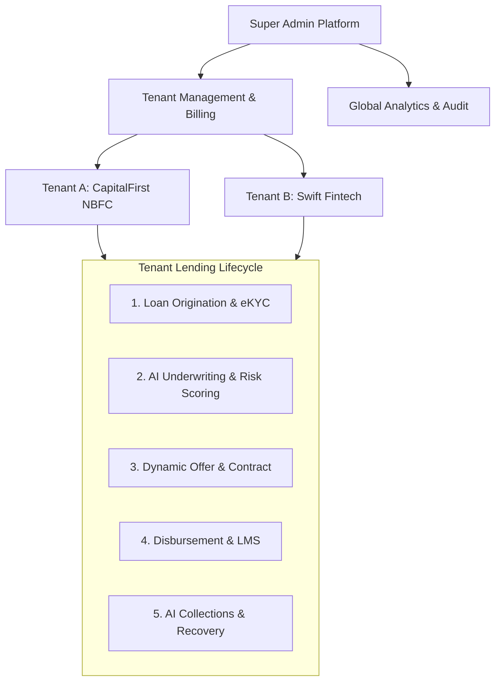

# LenderOS — Executive & Business Overview

> **A Multi-Tenant AI Lending Operating System for NBFCs, Fintechs, Banks, and Lending Service Providers (LSPs).**

---

## 1. Executive Summary

**LenderOS** is an enterprise-grade, multi-tenant AI lending operating system designed to modernize and democratize digital lending operations. Functioning as the **"Shopify + Salesforce + Stripe + OpenAI for Lending"**, LenderOS enables Non-Banking Financial Companies (NBFCs), Banks, Fintech platforms, and Lending Service Providers (LSPs) to launch, configure, scale, and automate their complete lending lifecycle within hours—without building complex infrastructure from scratch.

By providing isolated multi-tenant architecture, modular origination pipelines, automated eKYC/bureau integrations, AI-driven risk scoring, and automated collection management, LenderOS drastically reduces the time-to-market for digital lending products from months to days, while maintaining compliance with digital lending guidelines.

---

## 2. Market Opportunity & Industry Context

### The Challenge in Modern Digital Lending
1. **High Infrastructure Barriers**: Traditional banks and emerging NBFCs spend millions of dollars and 9–18 months constructing custom loan origination systems (LOS), loan management systems (LMS), and underwriting engines.
2. **Fragmented Ecosystem**: Integrating separate providers for eKYC (PAN/Aadhaar), Credit Bureaus (CIBIL/Experian), Bank Statement Analyzers, eSign, and Payment Gateways results in brittle code and fragile ops.
3. **Rigid Risk Models**: Conventional credit scoring relies solely on static bureau data, rejecting creditworthy underserved borrowers (MSMEs, gig workers, thin-file applicants).
4. **Regulatory & Audit Burden**: Digital Lending Guidelines (DLG) demand strict tenant isolation, audit logging, direct disbursement tracking, and transparent consent handling.

### The LenderOS Solution
LenderOS solves this by delivering an end-to-end cloud platform:
- **Instant Tenant Provisioning**: Spin up new lending entities with custom branding, product parameters, and risk appetites instantly.
- **Unified Origination & Risk Pipeline**: Single contract-driven API orchestration covering onboarding ➔ eKYC ➔ AI Risk Assessment ➔ Offer Generation ➔ Disbursement ➔ Collections.
- **Embedded AI Risk Engine**: Combines bureau credit scores, income stability metrics, debt-to-income (DTI) calculations, and behavioral metrics for instant decisioning.

---

## 3. Core Business Modules & Capability Architecture



### Module Breakdown
1. **Multi-Tenant Command Center**:
   - Super Admin view for global platform monitoring, tenant approvals, and usage metering.
   - Isolated Tenant Dashboards for NBFC/Fintech operational staff to manage daily loan queues.
2. **AI Risk & Underwriting Engine**:
   - Automated scoring algorithm evaluating Credit Score, Monthly Income, DTI Ratio, Employment Type, and Fraud Risk Score.
   - Auto-categorization into risk grades (`A1` to `C3`) with recommended credit caps and interest rates.
3. **Product Catalog & Rule Builder**:
   - Flexible product definition for Personal Loans, MSME Loans, Salary Advances, and BNPL.
   - Configurable min/max tenure, interest rates, processing fees, and grace periods per tenant.
4. **Delinquency & Collection Management**:
   - Automated DPD (Days Past Due) tracking.
   - AI priority scoring (`0-100`) to queue high-risk overdue accounts for relationship managers and collection agents.
5. **Customer Self-Service Portal (`/apply`)**:
   - Frictionless responsive applicant workflow for loan application submission, document upload, and real-time status tracking.

---

## 4. Target Customer Personas & Value Proposition

| Customer Persona | Primary Pain Point | LenderOS Value Proposition |
| :--- | :--- | :--- |
| **NBFCs & Regional Banks** | Legacy IT systems unable to support fast digital loan origination. | Turnkey digital LOS/LMS with automated eKYC, instant risk scoring, and zero infrastructure overhead. |
| **Fintech Startups & LSPs** | Long build time to launch new credit products (BNPL, Salary Advance). | Launch new lending products in 24 hours with custom white-labeled customer portals and pre-built APIs. |
| **Platform / Super Admins** | Managing multiple sub-brands or co-lending partnerships. | Unified multi-tenant dashboard with complete data isolation, centralized billing, and global audit trails. |
| **Borrowers & Applicants** | Slow manual loan approvals requiring paper documentation. | Sub-3-minute digital loan application flow with instant offer generation. |

---

## 5. Monetization & Business Revenue Model

LenderOS operates on a multi-tiered B2B SaaS + Usage Transaction revenue model:

```
┌────────────────────────────────────────────────────────────────────────┐
│                        LenderOS Revenue Streams                        │
└──────────────────┬─────────────────────────────────┬───────────────────┘
                   │                                 │
     ┌─────────────▼─────────────┐     ┌─────────────▼─────────────┐
     │  1. SaaS Base Subscriptions│     │ 2. Volume Disbursement Fee│
     │  - Standard NBFC: $1.5k/mo│     │  - 0.25% - 0.75% per loan │
     │  - Enterprise: $5k+/mo    │     │    disbursed on platform  │
     └───────────────────────────┘     └───────────────────────────┘
                   │                                 │
     ┌─────────────▼─────────────┐     ┌─────────────▼─────────────┐
     │ 3. API & Verification Pass│     │ 4. Add-on Marketplace Ops │
     │  - eKYC / Bureau API usage│     │  - Co-lending commissions │
     │  - AI Risk Scoring calls  │     │  - Insurance / Add-on cut │
     └───────────────────────────┘     └───────────────────────────┘
```

1. **SaaS Monthly Subscription**: Tiered monthly platform fee per tenant based on feature access and user seats.
2. **Disbursement Value Fee**: Percentage fee (`0.25% - 0.75%`) charged on total loan volume disbursed through the platform.
3. **API & Verification Metering**: Per-request fee for automated eKYC lookups, Credit Bureau fetches, and AI Risk Engine runs.
4. **Co-lending & Marketplace Revenue**: Commission on loan syndication and third-party financial product cross-selling (insurance, credit cards).

---

## 6. Regulatory Compliance & Security Architecture

- **Tenant Data Isolation**: Complete logical database-level isolation ensuring Tenant A can never access Tenant B data.
- **Audit Trails**: Immutable event logging for every loan status transition, risk evaluation, and user action for RBI / regulatory compliance.
- **Role-Based Access Control (RBAC)**: Granular permissions for `super_admin`, `tenant_admin`, `risk_manager`, `loan_manager`, `collection_manager`, and `auditor`.
- **Zero-Trust Auth & Key Safety**: Support for enterprise single sign-on (SSO) via Clerk with graceful fallback for offline/demo evaluation environments.

---

## 7. Strategic Growth & Roadmap

- **Phase 1 (Current)**: Multi-tenant core, automated underwriting, tenant administration, customer portal, and local demo engine.
- **Phase 2 (Upcoming)**: Direct eSign (Aadhaar OTP), Automated NACH / eNACH mandate registration, and Bank Statement Analyzer integration.
- **Phase 3 (Scale)**: Co-lending Marketplace (linking Capital-rich NBFCs with distribution Fintechs) and AI-driven automated collection bots.
