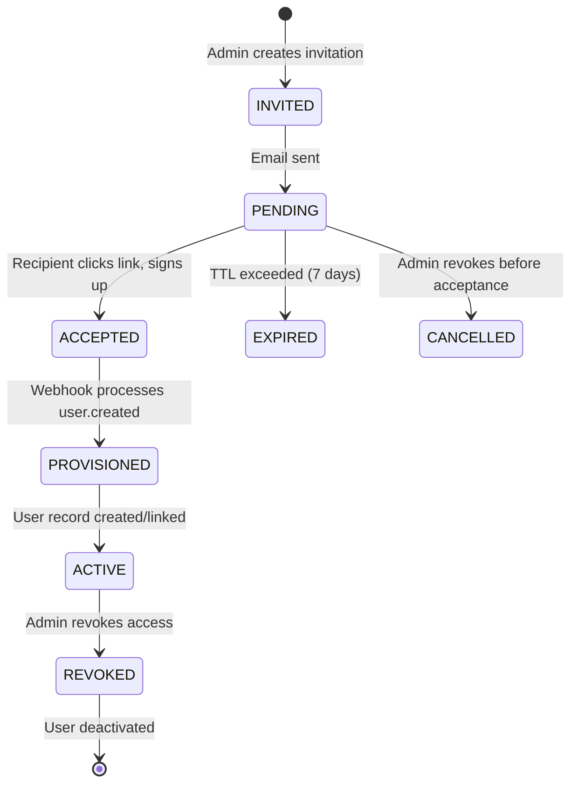

# LenderOS — Identity Provisioning Architecture

**Status:** M1b Implementation Specification  
**Purpose:** Single source of truth for invitation lifecycle, Clerk webhook integration, and customer-Clerk linking.

---

## 1. Overview

This document defines how external identities (Clerk) map to LenderOS business entities (Users, Customers) across all three POVs.

**Core Principle**: Clerk owns authentication; LenderOS owns authorization and business identity.

---

## 2. Entity Relationship

```
Clerk User (auth only)
    │
    ├─→ LenderOS User (staff/platform)
    │     clerkId (unique), tenantId, role, isActive
    │
    └─→ LenderOS Customer (borrower)
          clerkId (nullable, unique), tenantId
          │
          └─→ 1:1 with User (optional, for staff who are also borrowers)
```

### Tables

| Table | Clerk Link | Purpose |
|-------|------------|---------|
| `users` | `clerkId` (unique, required) | Staff, admins, platform roles |
| `customers` | `clerkId` (unique, nullable) | Borrowers |
| `invitations` | `clerkUserId` (filled post-webhook) | Pending onboarding |

---

## 3. Invitation Lifecycle

### States



### Invitation Entity

```typescript
// lib/db/src/schema/invitations.ts
export const invitationStatusEnum = pgEnum("invitation_status", [
  "invited",      // created, email queued
  "pending",      // email sent, awaiting signup
  "accepted",     // recipient clicked, Clerk signup initiated
  "provisioned",  // webhook processed, LenderOS record created
  "active",       // fully onboarded, can login
  "expired",      // TTL exceeded
  "cancelled",    // revoked before acceptance
  "revoked",      // revoked after provisioning
]);

export const invitationsTable = pgTable("invitations", {
  id: text("id").primaryKey(),
  email: text("email").notNull(),
  tenantId: text("tenant_id").notNull().references(() => tenantsTable.id),
  role: userRoleEnum("role").notNull(),  // tenant_admin, risk_manager, etc.
  invitedBy: text("invited_by").notNull().references(() => usersTable.id),
  status: invitationStatusEnum("status").notNull().default("invited"),
  token: text("token").notNull().unique(),  // secure acceptance token
  expiresAt: timestamp("expires_at").notNull(),
  acceptedAt: timestamp("accepted_at"),
  provisionedAt: timestamp("provisioned_at"),
  clerkUserId: text("clerk_user_id"),  // filled by webhook
  metadata: jsonb("metadata"),         // department, custom fields
  createdAt: timestamp("created_at").notNull().defaultNow(),
  updatedAt: timestamp("updated_at").notNull().defaultNow(),
});
```

### TTL
- **Default**: 7 days from creation
- **Configurable**: Per-tenant or per-role via `metadata`

---

## 4. Clerk Webhook Integration

### Endpoint
```
POST /api/webhooks/clerk
```

### Headers
```
Clerk-Signature: <signature>  // for verification
Content-Type: application/json
```

### Event: `user.created`

```json
{
  "object": "event",
  "type": "user.created",
  "data": {
    "id": "user_2abc123",
    "email_addresses": [{ "id": "idn_...", "email_address": "admin@nbfc.com" }],
    "first_name": "Priya",
    "last_name": "Mehta",
    "created_at": 1699999999999
  }
}
```

### Provisioning Logic (Pseudocode)

```typescript
async function handleUserCreated(clerkUser: ClerkUser) {
  const email = clerkUser.primaryEmailAddress;
  const clerkId = clerkUser.id;

  // 1. Check for pending invitation matching email
  const invitation = await db
    .select()
    .from(invitationsTable)
    .where(and(
      eq(invitationsTable.email, email),
      inArray(invitationsTable.status, ["pending", "accepted"])
    ))
    .limit(1);

  if (invitation.length > 0) {
    // PROVISION FROM INVITATION
    await provisionFromInvitation(invitation[0], clerkId, clerkUser);
    return;
  }

  // 2. Check for existing customer by email
  const customer = await db
    .select()
    .from(customersTable)
    .where(eq(customersTable.email, email))
    .limit(1);

  if (customer.length > 0) {
    // LINK CLERK ID TO EXISTING CUSTOMER
    await db
      .update(customersTable)
      .set({ clerkId })
      .where(eq(customersTable.id, customer[0].id));
    
    // Create user record with customer role
    await db.insert(usersTable).values({
      id: genId(),
      clerkId,
      email,
      firstName: clerkUser.firstName,
      lastName: clerkUser.lastName,
      role: "customer",
      tenantId: customer[0].tenantId,
      isActive: true,
    });
    return;
  }

  // 3. No existing record → create customer (self-serve borrower)
  // Note: tenantId must be determined from context (e.g., apply flow)
  // For pure self-serve, we may delay customer creation until /apply
}
```

### Security
- Verify Clerk signature using `CLERK_WEBHOOK_SECRET`
- Idempotency: handle duplicate webhook deliveries
- Rate limit: strict limiter on webhook endpoint
- Logging: audit all provisioning actions

---

## 5. Customer-Clerk Linking Rules

### When `customers.clerkId` Is Set
| Scenario | Action |
|----------|--------|
| Invitation accepted (staff) | `users.clerkId` set; `customers.clerkId` NOT set (separate entities) |
| Existing customer signs up | `customers.clerkId` = clerkId; create `users` with customer role |
| New borrower signs up | Defer until `/apply` completes; link at application submission |

### Email Uniqueness Strategy
- **Clerk email** = source of truth for authentication
- **LenderOS user email** = unique, mirrors Clerk
- **Customer email** = unique within tenant, may differ from Clerk (borrower may use personal email)
- **Matching**: During provisioning, match by email **only** when invitation or customer record exists

### Do NOT
- ❌ Auto-create staff users without invitation
- ❌ Merge `users` and `customers` tables
- ❌ Trust Clerk public metadata for roles/tenant

---

## 6. API Contracts

### Invitations

```
POST   /api/invitations              # Create invitation
GET    /api/invitations              # List (tenant-scoped)
GET    /api/invitations/:id          # Get details
POST   /api/invitations/:id/resend   # Resend email
POST   /api/invitations/:id/cancel   # Cancel (before acceptance)
POST   /api/invitations/:id/revoke   # Revoke (after provisioning)
```

### Webhooks

```
POST   /api/webhooks/clerk           # Clerk events (user.created, user.updated, user.deleted)
```

### Acceptance Flow (Frontend)

```
GET    /accept-invitation/:token     # Validate token, redirect to Clerk signup with redirect_url
```

---

## 7. Email Templates

### Invitation Email
```
Subject: You're invited to join {tenantName} on LenderOS

Body:
Hi {firstName},

{inviterName} has invited you to join {tenantName} as {roleLabel}.

Accept invitation: {acceptanceUrl}

This link expires in 7 days.

— LenderOS Team
```

### Acceptance URL Format
```
https://app.lenderos.com/accept-invitation/{token}?redirect=https://clerk.lenderos.com/sign-up
```

---

## 8. Seeding (Demo)

```typescript
// seed.ts additions
const demoInvitation = await upsertInvitation({
  id: genId(),
  email: "admin@newnbfc.com",
  tenantId: tenant1Id,
  role: "tenant_admin",
  invitedBy: u1, // superadmin
  status: "pending",
  token: "demo-token-123",
  expiresAt: new Date(Date.now() + 7 * 24 * 60 * 60 * 1000),
});
```

---

## 9. Testing Requirements

| Test | Description |
|------|-------------|
| Invitation CRUD | Create, list, get, resend, cancel, revoke |
| Invitation expiration | TTL triggers `expired` status |
| Webhook: invitation flow | `user.created` → provisions user with correct tenant+role |
| Webhook: existing customer | `user.created` → links clerkId to customer, creates user with customer role |
| Webhook: new borrower | `user.created` → defers customer creation until apply |
| Webhook: duplicate delivery | Idempotent handling |
| Tenant isolation | Invitation for tenant A cannot provision user in tenant B |
| Role validation | Webhook rejects invalid role for tenant |

---

## 10. Rollback / Migration Notes

### Adding `clerkId` to `customers`
```sql
ALTER TABLE customers ADD COLUMN clerk_id TEXT UNIQUE;
CREATE INDEX idx_customers_clerk_id ON customers(clerk_id);
```

### Creating `invitations` table
```sql
-- See schema definition above
```

### Backfill Strategy
- Existing seeded customers: leave `clerkId` null (demo mode uses `x-demo-user-id`)
- Production: link on first login via webhook

---

## 11. Related Documents

- `docs/00_LENDEROS_MASTER_PLAN.md` — Product architecture
- `docs/02_MILESTONES.md` — M1b scope and exit criteria
- `docs/03_ROLE_JOURNEYS.md` — Role onboarding journeys
- `docs/04_PRODUCT_WORKFLOWS.md` — Tenant onboarding workflow
- `docs/08_GAP_MATRIX.md` — Gap tracking

---

## 12. Decision Log

| Date | Decision | Rationale |
|------|----------|-----------|
| 2026-08-15 | Separate `users` and `customers` tables | Different lifecycles, RBAC scopes, compliance |
| 2026-08-15 | `customers.clerkId` nullable | Borrowers may not have Clerk account initially |
| 2026-08-15 | Invitation carries `tenantId` + `role` | Enables zero-trust provisioning; no email-only matching |
| 2026-08-15 | Webhook-driven provisioning | Decouples Clerk from LenderOS; supports multiple auth providers later |