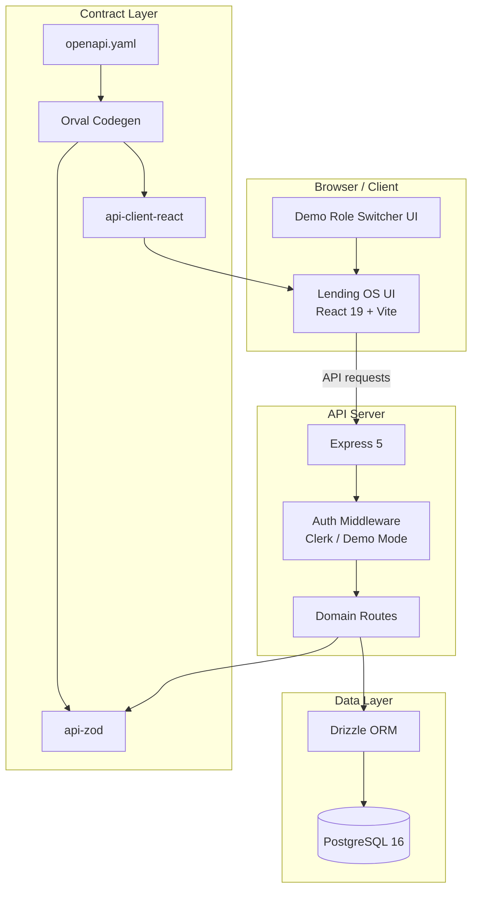
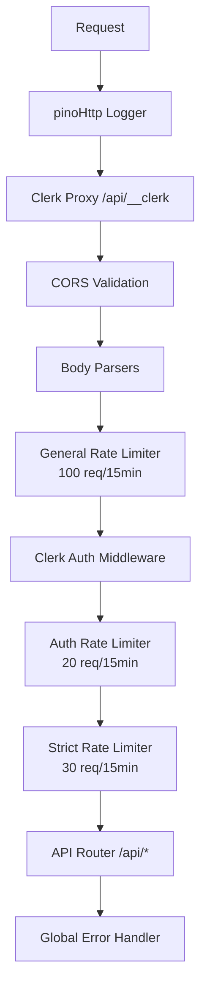
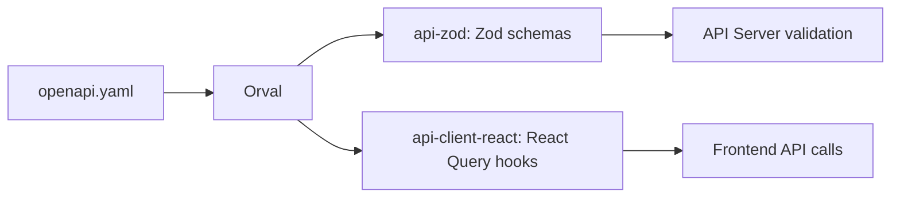

# LenderOS Architecture Documentation

## System Overview

LenderOS is a multi-tenant AI lending operating system built as a monorepo with
pnpm workspaces. It consists of a React 19 frontend, an Express 5 API server,
and a PostgreSQL 16 database with Drizzle ORM.

---

## High-Level Architecture



---

## Frontend Architecture (artifacts/lending-os)

### Entry Point
- `src/main.tsx` → `src/App.tsx`
- Wouter for routing (lightweight, hook-based)
- TanStack Query for server state management
- Clerk React for authentication UI

### Component Structure
```
src/
├── App.tsx              # Root component, routing, providers
├── main.tsx             # Entry point
├── pages/               # Page-level components
│   ├── landing.tsx      # Landing page
│   ├── dashboard-super.tsx  # Super admin dashboard
│   ├── dashboard-tenant.tsx # Tenant admin dashboard
│   ├── apply.tsx        # Customer loan application
│   ├── tenants/         # Tenant management pages
│   ├── applications/    # Loan application pages
│   ├── customers/       # Customer CRM pages
│   ├── loans/           # Active loans pages
│   └── collections/     # Collections pages
├── components/
│   ├── ui/              # ShadCN UI components
│   ├── layout/          # Layout components (DashboardLayout)
│   └── theme-provider.tsx
├── hooks/               # Custom React hooks
└── lib/                 # Utilities
```

### State Management
- **Server State**: TanStack Query (React Query) with generated hooks
- **Client State**: React Context (ThemeProvider, Demo Mode)
- **Authentication**: Clerk React (`useAuth`, `useUser`, `ClerkProvider`)

### Styling
- Tailwind CSS 4 (CSS-first configuration)
- ShadCN UI component library
- Dark mode default with localStorage persistence
- Custom CSS variables for theming

---

## Backend Architecture (artifacts/api-server)

### Entry Point
- `src/index.ts` → `src/app.ts` (createApp factory)
- Express 5 with TypeScript

### Middleware Chain (Order of Execution)



### Route Organization
```
src/routes/
├── index.ts             # Router aggregation
├── health.ts            # Health check (no auth, no rate limit)
├── health.test.ts       # Vitest tests
├── tenants.ts           # Tenant management
├── users.ts             # User management
├── customers.ts         # Customer CRM
├── loanProducts.ts      # Loan product catalog
├── loanApplications.ts  # Loan applications
├── kyc.ts               # KYC verification
├── risk.ts              # AI risk scoring
├── offers.ts            # Loan offers
├── loans.ts             # Active loans
├── repayments.ts        # Repayment tracking
├── collections.ts       # Collections management
├── analytics.ts         # Platform analytics
└── settings.ts          # Tenant settings
```

### Authentication (`src/lib/auth.ts`)
- Clerk integration via `@clerk/express`
- Demo mode fallback for local development
- `requireAuth` middleware attaches:
  - `req.clerkId` — Clerk user ID or demo ID
  - `req.userRole` — User role from database
  - `req.user` — Full user object from database

### Authorization (`src/middlewares/rbac.ts`)
- Role hierarchy with numeric levels:
  - super_admin (100), platform_admin (90), tenant_owner (80), tenant_admin (70)
  - risk_manager (60), loan_manager (50), collection_manager (40)
  - customer_support (30), sales_agent (20), dsa (15), relationship_manager (10)
  - customer/auditor/compliance_officer (5)
- Middleware functions:
  - `requireRole(...roles)` — generic role check
  - `requireSuperAdmin()` — platform admin access
  - `requireTenantAdmin()` — tenant admin + above
  - `requireTenantAccess()` — any tenant role
  - `requireCustomerAccess()` — customer + above
  - `ensureTenantAccess()` — tenant isolation guard

### Rate Limiting (`src/middlewares/rateLimiter.ts`)
Three tiers using `express-rate-limit`:
- **General**: 100 req/15min (all routes except `/healthz`)
- **Auth**: 20 req/15min (`/api/auth`, `/api/sign-in`, `/api/sign-up`)
- **Strict**: 30 req/15min (`/api/tenants`, `/api/users`)

### CORS Configuration
- Configured via `CORS_ALLOWED_ORIGINS` environment variable
- Defaults: `http://localhost:5173`, `http://localhost:3000`
- Credentials enabled for cookie-based auth

---

## Database Architecture (lib/db)

### Connection
- `src/index.ts` exports `pool` (pg.Pool) and `db` (Drizzle instance)
- Connection string from `DATABASE_URL` environment variable

### Schema (`src/schema/`)
| Table | Description |
|-------|-------------|
| `tenants` | Lending entities (NBFC, Bank, FinTech, LSP) |
| `users` | Platform users with roles and tenant association |
| `customers` | End borrowers linked to tenants |
| `loan_products` | Loan product definitions per tenant |
| `loan_applications` | Loan application requests |
| `loans` | Active/disbursed loans |
| `repayments` | EMI repayment schedule & payments |
| `collections` | Collections cases for overdue loans |
| `kyc_records` | KYC verification records |
| `risk_scores` | AI risk assessment scores |
| `tenant_settings` | Tenant-specific configuration |

### Key Enums
- `tenant_type`: nbfc, bank, lsp, fintech
- `tenant_status`: active, pending, suspended, inactive
- `user_role`: 14 roles from super_admin to customer
- `loan_application_status`: submitted, under_review, kyc_pending, approved, rejected, disbursed
- `loan_status`: active, closed, defaulted, restructured
- `kyc_status`: pending, partial, verified, rejected

---

## API Architecture

### OpenAPI-First Contract Layer
```
lib/api-spec/openapi.yaml  (Single Source of Truth)
         │
         ▼
    Orval Codegen
         │
         ├──▶ lib/api-zod/src/generated/     # Zod schemas
         │
         └──▶ lib/api-client-react/src/      # React Query hooks + custom fetch
```

### Generated Artifacts
- **Zod Schemas** (`@workspace/api-zod`): Request/response validation
- **React Query Hooks** (`@workspace/api-client-react`): Type-safe API calls
- **TypeScript Types**: Shared between frontend and backend

### API Endpoints
All routes under `/api`:
- `GET /healthz` — Health check (public)
- `GET/POST /tenants` — Tenant management (super_admin)
- `GET/POST/PATCH/DELETE /tenants/:id` — Tenant CRUD
- `GET /users` — User management (super_admin)
- `GET/POST /customers` — Customer CRM (tenant_access)
- `GET/POST /loan-products` — Product catalog (tenant_access)
- `GET/POST /loan-applications` — Applications (tenant_access)
- `GET/POST /kyc` — KYC verification (tenant_access)
- `GET/POST /risk` — Risk scoring (tenant_access)
- `GET/POST /offers` — Loan offers (tenant_access)
- `GET/POST /loans` — Active loans (tenant_access)
- `GET/POST /repayments` — Repayments (tenant_access)
- `GET/POST /collections` — Collections (tenant_access)
- `GET /analytics` — Platform analytics (super_admin)
- `GET/PATCH /settings` — Tenant settings (tenant_access)

---

## Contract Layer (lib/api-spec, lib/api-zod, lib/api-client-react)

### Code Generation Flow


### Orval Configuration (`lib/api-spec/orval.config.ts`)
- Generates both Zod schemas and React Query hooks
- Uses custom fetch from `lib/api-client-react/src/custom-fetch.ts`
- Output mode: split (one file per endpoint)
- Clean output directory on each generation

---

## Frontend-Backend Communication

### Development
- Vite dev server proxies `/api` to `http://localhost:5000`
- Direct API calls during development

### Production
- Frontend served statically or via CDN
- API calls to production API server URL
- Clerk proxy middleware for auth on custom domains

### Authentication Headers
- **Production**: Clerk session cookies + JWT
- **Demo Mode**: `x-demo-user-id` header (set via localStorage)
- **Custom Fetch**: Auto-attaches demo header from localStorage

---

## Deployment Architecture

### Local Development
```
Docker Compose → PostgreSQL 16
    │
    ▼
pnpm dev → Concurrent: API Server (5000) + Frontend (5173)
```

### Production Considerations
- PostgreSQL: Managed service (RDS, Cloud SQL, etc.)
- API Server: Container orchestration (K8s, ECS, Cloud Run)
- Frontend: Static hosting (Vercel, Netlify, Cloudflare Pages)
- Clerk: Production instance with custom domain
- Redis: For distributed rate limiting (future)
- Monitoring: Health check at `/api/healthz` for load balancers

---

## Security Architecture

### Authentication
- Clerk handles user management, MFA, social login
- Custom proxy middleware for custom domains
- Demo mode only in development

### Authorization
- RBAC middleware on all protected routes
- Tenant isolation via `ensureTenantAccess()`
- Role hierarchy prevents privilege escalation

### Network
- CORS restricted to configured origins
- Rate limiting on all endpoints
- Helmet.js headers (planned)

### Data
- Parameterized queries via Drizzle ORM
- No secrets in codebase
- Environment-based configuration

---

## Observability

### Logging
- Pino structured logging
- Request/response serialization
- Error context capture

### Health Checks
- `/api/healthz` returns:
  - Overall status: ok/degraded/down
  - API status
  - Database connectivity
  - Server uptime
  - Timestamp
  - Version

### Metrics (Planned)
- Prometheus metrics endpoint
- Custom business metrics
- Distributed tracing